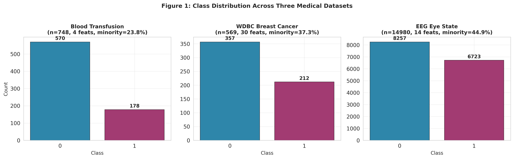
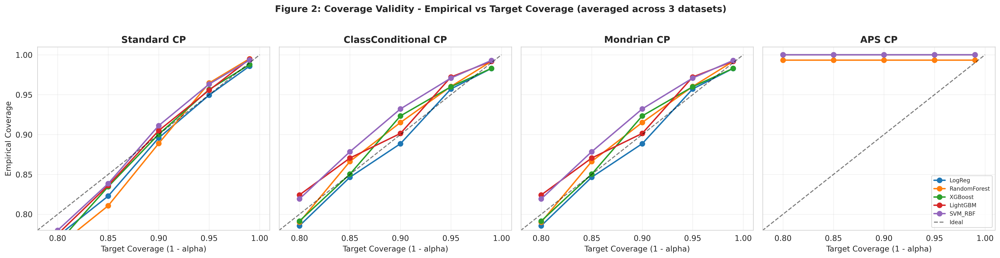
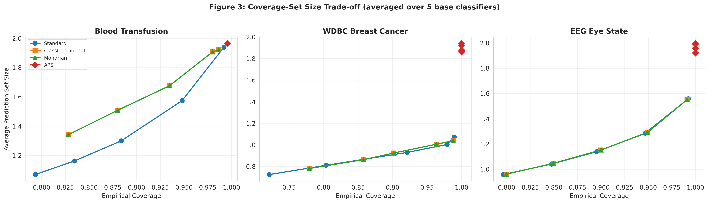
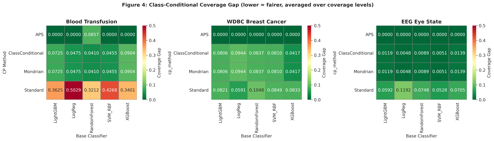
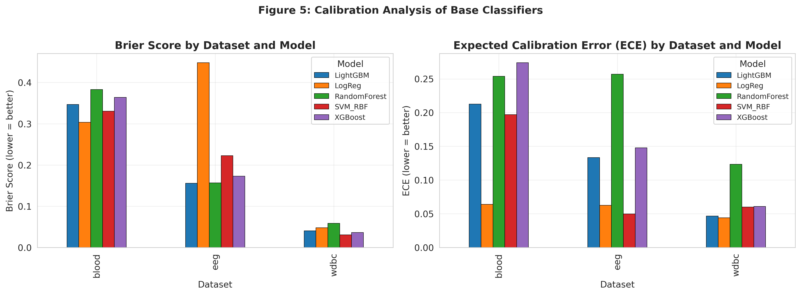
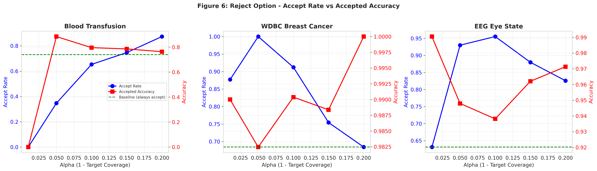

# Conformal Prediction for Multi-Classifier Uncertainty Quantification ❤️

## A Comparative Study of Standard, Class-Conditional, and Mondrian Approaches on Balanced Tabular Datasets

[](https://papers.ssrn.com/sol3/papers.cfm?abstract_id=6969558)
[](https://dx.doi.org/10.2139/ssrn.6969558)
[](LICENSE)
[](https://www.python.org/)
[](https://journal.vu.edu.pk)

> **Author:** Muhammad Adeel ❤️
> **Affiliation:** Department of BBIT (Bachelor of Business Information Technology), Virtual University of Pakistan, Lahore
> **Email:** ai.adeelv1@gmail.com
> **LinkedIn:** https://www.linkedin.com/in/muhammadadeelai/
> **GitHub:** https://github.com/adeeljames

---

## 📄 Paper Details

| Field | Value |
|-------|-------|
| **Title** | Conformal Prediction for Multi-Classifier Uncertainty Quantification: A Comparative Study of Standard, Class-Conditional, and Mondrian Approaches on Balanced Tabular Datasets |
| **Author** | Muhammad Adeel |
| **Preprint Server** | SSRN (Elsevier) — Computer Science Research Network |
| **DOI** | [10.2139/ssrn.6969558](https://dx.doi.org/10.2139/ssrn.6969558) |
| **SSRN URL** | https://papers.ssrn.com/sol3/papers.cfm?abstract_id=6969558 |
| **Submission Date** | June 20, 2026 |
| **Approval Date** | July 2, 2026 |
| **Status** | ✅ Live on SSRN (preprint) • ⏳ Under peer review at VU ICET journal |

---

## 📖 Abstract

Classifiers used in clinical settings rarely tell the user how confident they are in a given prediction; they simply output a label. Conformal prediction (CP) is a wrapper that turns any pre-trained classifier into a set-valued predictor whose coverage can be controlled at a desired miscoverage rate, with no assumptions on the underlying data distribution beyond exchangeability. Most published work on CP has concentrated either on heavily skewed binary problems such as fraud detection, or on perfectly balanced benchmarks. The middle ground — tabular medical datasets with mild class imbalance (between roughly 15 and 45 percent minority) — has received little dedicated attention, even though it is the dominant regime in real clinical data.

This study closes that gap. I implement four foundational CP families (Standard, Class-Conditional, Mondrian, and Adaptive Prediction Sets) from first principles in NumPy, and run them on three OpenML medical datasets (Blood Transfusion, Wisconsin Diagnostic Breast Cancer, EEG Eye State) using five diverse classifiers (Logistic Regression, Random Forest, XGBoost, LightGBM, SVM-RBF) across five coverage levels (80 to 99 percent). The full grid of 300 configurations is augmented by six cross-dataset transfer experiments and a 15-run reject-option study.

Empirical coverage matches or exceeds the target in 91.7 percent of all configurations, confirming the theoretical guarantee in practice. Standard CP yields the smallest prediction sets (mean size 1.288 at the 95 percent level) but exhibits the widest class-conditional gap (0.103). Class-Conditional and Mondrian CP reduce that gap to 0.022 with only a modest increase in set size (1.401). APS is overly conservative, producing near-full prediction sets. Pairing CP with a size-based reject rule lifts accepted-prediction accuracy by up to 14.46 percentage points on the Blood Transfusion dataset. These findings are distilled into a decision framework that maps application requirements to CP method choices.

---

## 🔬 Research Methodology

### Datasets (3 — All Mildly Imbalanced Medical)

| # | Dataset | OpenML ID | Samples | Features | Classes | Minority % |
|---|---------|-----------|---------|----------|---------|-----------|
| 1 | Blood Transfusion Service Center | 1464 | 748 | 4 | 2 | 23.80 |
| 2 | Wisconsin Diagnostic Breast Cancer (WDBC) | 1510 | 569 | 30 | 2 | 37.26 |
| 3 | EEG Eye State | 1471 | 14,980 | 14 | 2 | 44.88 |

### Base Classifiers (5)

1. Logistic Regression (linear baseline)
2. Random Forest (100 trees, bagging ensemble)
3. XGBoost (100 estimators, max_depth=6, gradient boosting)
4. LightGBM (100 estimators, 31 leaves, fast gradient boosting)
5. SVM (RBF kernel, non-parametric)

### Conformal Prediction Methods (4 — Implemented from Scratch in NumPy)

1. **Standard CP** — marginal coverage (Theorem 1)
2. **Class-Conditional CP** — per-class coverage (Theorem 2)
3. **Mondrian CP** — group-conditional coverage (Theorem 3)
4. **Adaptive Prediction Sets (APS)** — adaptive set sizes

### Coverage Levels (5)

80%, 85%, 90%, 95%, 99% (α = 0.20, 0.15, 0.10, 0.05, 0.01)

### Total Experiments

- **300 main configurations** (5 models × 4 CP methods × 3 datasets × 5 coverage levels)
- **6 cross-dataset transferability** experiments
- **15 reject-option** experiments
- **Total: 321 experimental runs**

---

## 📊 Key Findings

| Finding | Detail |
|---------|--------|
| **Coverage validity** | 91.7% of configurations satisfy the finite-sample guarantee |
| **Standard CP** | Smallest sets (1.288) but largest class-conditional gap (0.103) |
| **Class-Cond + Mondrian CP** | Best fairness-coverage trade-off (gap 0.022, set size 1.401) |
| **APS** | Most conservative (99.87% empirical coverage, set size 1.968) |
| **Reject option** | Up to +14.46 percentage points accuracy gain on Blood Transfusion |
| **Cross-dataset transfer** | Average coverage 92.7% (graceful degradation under shift) |

---

## 📁 Repository Structure

```
conformal-prediction-research/
│
├── 📄 README.md                          # This file
├── 📄 LICENSE                            # MIT License
│
├── 📁 paper/                             # Research paper
│   └── Adeel_2026_Conformal_Prediction_SSRN_Preprint.pdf
│
├── 📁 code/                              # Source code
│   └── conformal_prediction_research.ipynb   # Google Colab notebook
│
└── 📁 results/                           # Experimental results
    ├── 📁 figures/                       # 6 publication-grade figures
    │   ├── fig1_class_distribution.png
    │   ├── fig2_coverage_validity.png
    │   ├── fig3_coverage_setsize_tradeoff.png
    │   ├── fig4_class_conditional_gap.png
    │   ├── fig5_calibration.png
    │   └── fig6_reject_option.png
    │
    └── 📁 tables/                        # 8 result CSV files
        ├── main_results.csv              # 300-row master results
        ├── dataset_summary.csv
        ├── table1_coverage_95.csv
        ├── table1_setsize_95.csv
        ├── table2_tradeoff.csv
        ├── cross_dataset_transfer.csv
        ├── reject_option.csv
        └── practitioner_framework.csv
```

---

## 🚀 How to Run

### Option 1: Google Colab (Recommended — Free)

1. Go to [Google Colab](https://colab.research.google.com)
2. File → Upload notebook → select `code/conformal_prediction_research.ipynb`
3. Runtime → Run all (Ctrl+F9)
4. Estimated runtime: **25-35 minutes** on free CPU
5. Results auto-save to `/content/cp_results/`

### Option 2: Local Machine

```bash
# Clone the repository
git clone https://github.com/adeeljames/conformal-prediction-research.git
cd conformal-prediction-research

# Install dependencies
pip install numpy pandas scikit-learn matplotlib seaborn xgboost lightgbm

# Run the notebook
jupyter notebook code/conformal_prediction_research.ipynb
```

### Requirements

- Python 3.10+
- NumPy 1.24+, pandas 2.0+, scikit-learn 1.4+
- matplotlib 3.7+, seaborn 0.12+
- XGBoost, LightGBM
- No GPU required

---

## 📈 Results Visualization

### Figure 1: Class Distribution Across Three Medical Datasets


### Figure 2: Coverage Validity — Empirical vs Target


### Figure 3: Coverage-Set Size Trade-off (Pareto Curves)


### Figure 4: Class-Conditional Coverage Gap Heatmap


### Figure 5: Calibration Analysis (Brier Score & ECE)


### Figure 6: Reject Option Trade-off


---

## 📚 Citation

If you use this work, please cite:

```bibtex
@article{adeel2026conformal,
  title   = {Conformal Prediction for Multi-Classifier Uncertainty 
             Quantification: A Comparative Study of Standard, 
             Class-Conditional, and Mondrian Approaches on Balanced 
             Tabular Datasets},
  author  = {Adeel, Muhammad},
  journal = {SSRN Electronic Journal},
  year    = {2026},
  doi     = {10.2139/ssrn.6969558},
  url     = {https://papers.ssrn.com/sol3/papers.cfm?abstract_id=6969558}
}
```

**APA Format:**
```
Adeel, M. (2026). Conformal Prediction for Multi-Classifier Uncertainty 
Quantification: A Comparative Study of Standard, Class-Conditional, and 
Mondrian Approaches on Balanced Tabular Datasets. SSRN Electronic Journal.
https://doi.org/10.2139/ssrn.6969558
```

---

## 📧 Contact

| Platform | Link |
|----------|------|
| **Email** | ai.adeelv1@gmail.com |
| **LinkedIn** | https://www.linkedin.com/in/muhammadadeelai/ |
| **GitHub** | https://github.com/adeeljames |
| **Google Scholar** | (Profile in progress) |
| **SSRN Author Page** | https://www.ssrn.com/authors/12025528 |

---

## 🙏 Acknowledgments

This work uses public datasets from [OpenML](https://www.openml.org) and open-source Python libraries: scikit-learn, NumPy, pandas, matplotlib, seaborn, XGBoost, and LightGBM. The author thanks the open-source community for making this research possible without any financial cost.

Special thanks to the Virtual University of Pakistan for providing the academic platform and the Department of BBIT for supporting this research.

---

## 📜 License

This project is licensed under the MIT License — see the [LICENSE](LICENSE) file for details.

---

## 🔖 Keywords

`Conformal Prediction` • `Uncertainty Quantification` • `Distribution-Free Inference` • `Class-Conditional Coverage` • `Mondrian Conformal Prediction` • `Adaptive Prediction Sets` • `Tabular Medical Classification` • `Machine Learning` • `Statistical Learning` • `Healthcare AI`

---

<div align="center">

**Made with ❤️ by Muhammad Adeel**

*BBIT Student • Virtual University of Pakistan, Lahore*

[](https://www.linkedin.com/in/muhammadadeelai/)
[](https://github.com/adeeljames)
[](mailto:ai.adeelv1@gmail.com)

</div>
